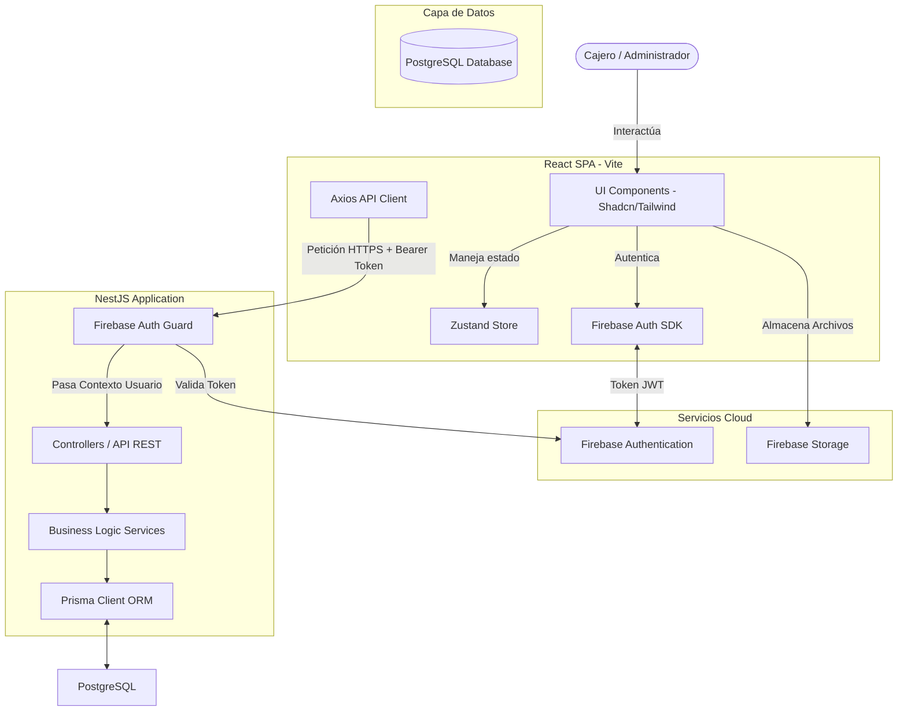

# Documento 2: Arquitectura del Sistema

Este documento describe la arquitectura global, la estructura frontend y backend del **Sistema Web de Caja e Inventario para la Licorería "La Ruta"**.

---

## 1. Arquitectura del Sistema (Arquitectura de Contenedores)

El sistema sigue un patrón de arquitectura desacoplada donde el frontend (SPA) interactúa directamente con Firebase para autenticación y consume servicios del backend RESTful, el cual se comunica con la base de datos PostgreSQL mediante Prisma ORM.



---

## 2. Arquitectura Frontend (React + Vite + TypeScript)

### Estructura de Directorios Propuesta
El frontend se organiza siguiendo principios de diseño limpio y separación de responsabilidades:

```text
src/
├── assets/             # Imágenes, logos, fuentes globales.
├── components/         # Componentes UI reutilizables comunes (botones, inputs, tablas).
│   └── ui/             # Componentes de Shadcn UI (dialog, table, button, select).
├── config/             # Configuración de Firebase y variables de entorno.
├── features/           # Estructura modular basada en características del negocio.
│   ├── auth/           # Login, estado de sesión, redirección.
│   ├── caja/           # Vistas de Apertura, Cierre, Historial de Cajas.
│   ├── inventario/     # Grid de stock, edición de productos, alertas.
│   ├── ventas/         # Terminal Punto de Venta (POS), selección de impulsadoras.
│   └── egresos/        # Formulario de egresos diarios.
├── hooks/              # Custom hooks globales (ej: useDebounce, useAuth).
├── layouts/            # Plantillas de diseño (DashboardLayout, AuthLayout).
├── routes/             # Configuración de React Router Dom (Rutas públicas y protegidas).
├── services/           # Clientes HTTP (Axios) para peticiones a la API.
├── stores/             # Manejador de estado global con Zustand (authStore, cajaStore).
├── types/              # Tipos y contratos TypeScript compartidos.
├── utils/              # Funciones auxiliares y formateadores (fechas, monedas).
├── App.tsx             # Componente raíz.
├── index.css           # Configuración de Tailwind CSS y tokens de diseño.
└── main.tsx            # Punto de entrada de la aplicación.
```

### Gestión de Estado Global (Zustand)
Para evitar el "prop drilling" y mantener un POS fluido, se implementará un almacén de estado con Zustand estructurado de la siguiente forma:

1. **`authStore`**: Almacena el token JWT de Firebase, los datos del usuario logueado (cajero/administrador) y su rol.
2. **`cajaStore`**: Mantiene en memoria si hay un turno de caja activo, el ID de la caja abierta y montos calculados en tiempo real.
3. **`posStore`**: Almacena el carrito de compras temporal durante una venta (productos, cantidad, impulsadora seleccionada y método de pago).

---

## 3. Arquitectura Backend (NestJS + Prisma)

### Estructura del Backend Modular
El backend sigue el patrón modular nativo de NestJS para facilitar el mantenimiento y la extensibilidad:

```text
src/
├── common/                 # Decoradores, interceptores, excepciones globales y DTOs comunes.
│   ├── decorators/         # @GetUser, @Roles.
│   ├── filters/            # HttpExceptionFilter para formateo estándar de errores.
│   ├── guards/             # FirebaseAuthGuard, RolesGuard.
│   └── interceptors/       # LoggingInterceptor, TransformInterceptor.
├── config/                 # Configuración de variables de entorno y Firebase Admin SDK.
├── modules/                # Módulos del dominio del negocio.
│   ├── auth/               # Registro, Login y validación de tokens de Firebase Admin SDK.
│   ├── caja/               # Lógica de turnos, apertura, egresos y cierres.
│   ├── inventario/         # CRUD de productos, categorías y stock.
│   ├── ventas/             # Procesamiento de transacciones e historial.
│   └── impulsadoras/       # CRUD y listados de impulsadoras.
├── prisma/                 # Archivos de configuración de Prisma (schema.prisma y migraciones).
│   └── seed.ts             # Semilla de base de datos para roles y categorías iniciales.
├── app.module.ts           # Módulo principal que integra todos los submódulos.
└── main.ts                 # Punto de entrada de la API NestJS (CORS, Prefijo global API, Swagger).
```

### Mecanismo de Seguridad y Autenticación
1. **Autenticación Delegada**: El frontend realiza el login directamente contra Firebase Client SDK.
2. **Transferencia de Token**: Tras la autenticación, el frontend envía el Firebase ID Token (JWT) en el header de autorización `Authorization: Bearer <JWT>` para todas las llamadas al backend.
3. **Validación del Backend**: El `FirebaseAuthGuard` en NestJS intercepta la petición, utiliza el `Firebase Admin SDK` (`admin.auth().verifyIdToken()`) para decodificar el token de forma asíncrona, verifica su firma y expira.
4. **Roles en DB**: Una vez verificado el token de Firebase, el backend consulta el email del usuario en la base de datos PostgreSQL local para determinar y adjuntar su rol respectivo (`ADMIN` o `CAJERO`) al objeto de la solicitud (`req.user`).

```text
Petición HTTP con Bearer Token 
    │
    ▼
[FirebaseAuthGuard] (Valida con Firebase Admin SDK) 
    │
    ├─► Token Inválido o Expirado ──► Retorna 401 Unauthorized
    │
    ▼ Token Válido
[RolesGuard] (Verifica si el rol en DB coincide con la ruta)
    │
    ├─► Cajero en ruta de Administrador ──► Retorna 403 Forbidden
    │
    ▼ Autorizado
Ejecución del Controlador del Endpoint
```
