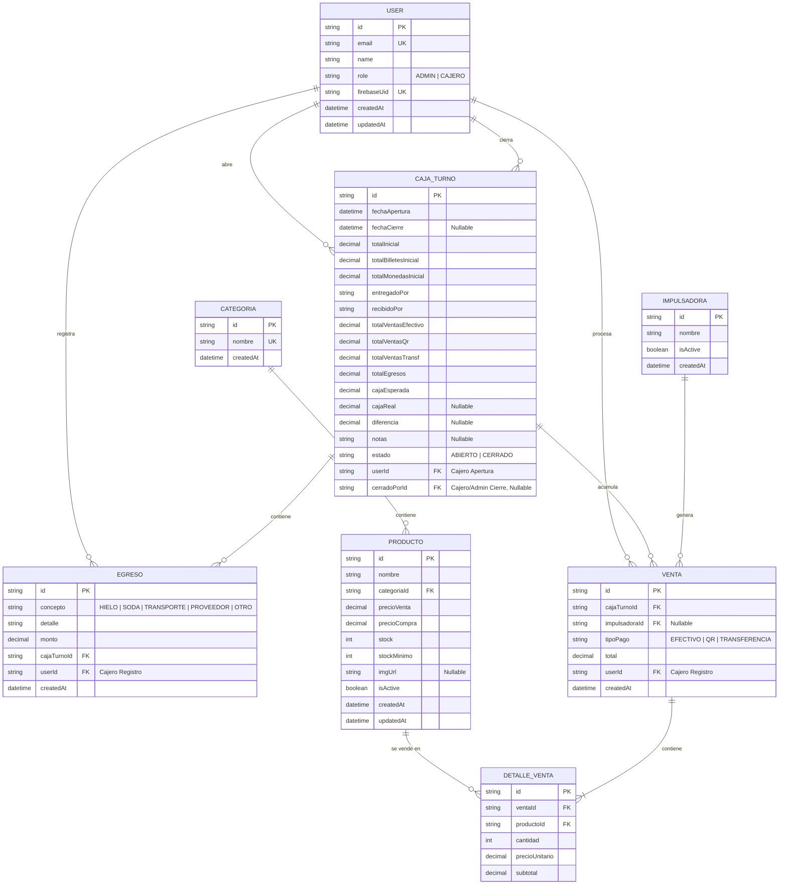

# Documento 3: Modelo de Datos y Especificación de la API

Este documento contiene la definición del modelo de datos de la base de datos PostgreSQL mediante un esquema de Prisma y la especificación de la API REST que conecta el frontend y backend.

---

## 1. Diagrama Entidad-Relación (ERD)

El siguiente diagrama modela la base de datos relacional para soportar las ventas con impulsadoras, el control estricto de los turnos de caja única y el inventario.



---

## 2. Modelo de Datos (Esquema Prisma)

Este código representa la implementación física de la base de datos utilizando `schema.prisma`.

```prisma
datasource db {
  provider = "postgresql"
  url      = env("DATABASE_URL")
}

generator client {
  provider = "prisma-client-js"
}

enum Role {
  ADMIN
  CAJERO
}

enum EstadoCaja {
  ABIERTO
  CERRADO
}

enum ConceptoEgreso {
  HIELO
  SODA
  TRANSPORTE
  PROVEEDOR
  OTRO
}

enum TipoPago {
  EFECTIVO
  QR
  TRANSFERENCIA
}

model User {
  id            String      @id @default(uuid())
  email         String      @unique
  name          String
  role          Role        @default(CAJERO)
  firebaseUid   String      @unique
  createdAt     DateTime    @default(now())
  updatedAt     DateTime    @updatedAt
  
  // Relaciones
  cajasAbiertas  CajaTurno[] @relation("CajeroApertura")
  cajasCerradas  CajaTurno[] @relation("CajeroCierre")
  egresos        Egreso[]
  ventas         Venta[]

  @@map("users")
}

model CajaTurno {
  id                   String      @id @default(uuid())
  fechaApertura        DateTime    @default(now())
  fechaCierre          DateTime?
  totalInicial         Decimal     @db.Decimal(10, 2)
  totalBilletesInicial Decimal     @db.Decimal(10, 2)
  totalMonedasInicial  Decimal     @db.Decimal(10, 2)
  entregadoPor         String
  recibidoPor          String
  
  // Totales acumulados calculados por el sistema en base a transacciones
  totalVentasEfectivo  Decimal     @default(0.00) @db.Decimal(10, 2)
  totalVentasQr        Decimal     @default(0.00) @db.Decimal(10, 2)
  totalVentasTransf    Decimal     @default(0.00) @db.Decimal(10, 2)
  totalEgresos         Decimal     @default(0.00) @db.Decimal(10, 2)
  
  // Totales financieros de cierre
  cajaEsperada         Decimal     @db.Decimal(10, 2)
  cajaReal             Decimal?    @db.Decimal(10, 2)
  diferencia           Decimal?    @db.Decimal(10, 2)
  notas                String?     @db.Text
  estado               EstadoCaja  @default(ABIERTO)
  
  // Relaciones y Auditoría
  userId               String
  userApertura         User        @relation("CajeroApertura", fields: [userId], onDelete: Restrict)
  cerradoPorId         String?
  userCierre           User?       @relation("CajeroCierre", fields: [cerradoPorId], onDelete: Restrict)
  
  egresosAsociados     Egreso[]
  ventasAsociadas      Venta[]

  @@map("caja_turnos")
}

model Egreso {
  id           String         @id @default(uuid())
  concepto     ConceptoEgreso
  detalle      String         @db.VarChar(255)
  monto        Decimal        @db.Decimal(10, 2)
  createdAt    DateTime       @default(now())
  
  // Relaciones
  cajaTurnoId  String
  cajaTurno    CajaTurno      @relation(fields: [cajaTurnoId], onDelete: Cascade)
  userId       String
  cajero       User           @relation(fields: [userId], onDelete: Restrict)

  @@map("egresos")
}

model Impulsadora {
  id        String   @id @default(uuid())
  nombre    String   @db.VarChar(100)
  isActive  Boolean  @default(true)
  createdAt DateTime @default(now())
  
  // Relaciones
  ventas    Venta[]

  @@map("impulsadoras")
}

model Categoria {
  id        String     @id @default(uuid())
  nombre    String     @unique @db.VarChar(50)
  createdAt DateTime   @default(now())
  
  // Relaciones
  productos Producto[]

  @@map("categorias")
}

model Producto {
  id           String         @id @default(uuid())
  nombre       String         @db.VarChar(150)
  precioVenta  Decimal        @db.Decimal(10, 2)
  precioCompra Decimal        @db.Decimal(10, 2)
  stock        Int
  stockMinimo  Int            @default(5)
  imgUrl       String?        @db.Text
  isActive     Boolean        @default(true)
  createdAt    DateTime       @default(now())
  updatedAt    DateTime       @updatedAt
  
  // Relaciones
  categoriaId  String
  categoria    Categoria      @relation(fields: [categoriaId], onDelete: Restrict)
  detalles     DetalleVenta[]

  @@map("productos")
}

model Venta {
  id            String         @id @default(uuid())
  tipoPago      TipoPago
  total         Decimal        @db.Decimal(10, 2)
  createdAt     DateTime       @default(now())
  
  // Relaciones
  cajaTurnoId   String
  cajaTurno     CajaTurno      @relation(fields: [cajaTurnoId], onDelete: Restrict)
  impulsadoraId String?
  impulsadora   Impulsadora?   @relation(fields: [impulsadoraId], onDelete: SetNull)
  userId        String
  cajero        User           @relation(fields: [userId], onDelete: Restrict)
  
  detalles      DetalleVenta[]

  @@map("ventas")
}

model DetalleVenta {
  id             String   @id @default(uuid())
  cantidad       Int
  precioUnitario Decimal  @db.Decimal(10, 2)
  subtotal       Decimal  @db.Decimal(10, 2)
  
  // Relaciones
  ventaId        String
  venta          Venta    @relation(fields: [ventaId], onDelete: Cascade)
  productoId     String
  producto       Producto @relation(fields: [productoId], onDelete: Restrict)

  @@map("detalle_ventas")
}
```

---

## 3. Especificación de la API REST

Todos los endpoints (excepto login) requieren la cabecera `Authorization: Bearer <Firebase_ID_Token>`. El prefijo global de la API es `/api`.

### 3.1 Módulo de Autenticación (`/auth`)

* **`GET /auth/me`**
  * **Descripción:** Obtiene los datos del usuario logueado en base al token de Firebase.
  * **Respuesta (200 OK):**
    ```json
    {
      "id": "user-uuid",
      "email": "cajero@laruta.com",
      "name": "Carlos Pérez",
      "role": "CAJERO"
    }
    ```
* **`POST /auth/register-cajero` (Solo ADMIN)**
  * **Descripción:** Crea un nuevo cajero en el sistema y en Firebase Authentication.
  * **Payload:** `{ "email": "juan@laruta.com", "password": "SecurePassword123", "name": "Juan Gómez" }`
  * **Respuesta (201 Created):** `{ "message": "Usuario creado con éxito", "id": "uuid" }`

### 3.2 Módulo de Caja (`/caja`)

* **`GET /caja/activo`**
  * **Descripción:** Obtiene los datos del turno de caja actualmente activo (abierto).
  * **Respuesta (200 OK):**
    * *Si hay caja activa:*
      ```json
      {
        "id": "caja-uuid",
        "fechaApertura": "2026-06-03T08:00:00Z",
        "totalInicial": 200.00,
        "totalBilletesInicial": 150.00,
        "totalMonedasInicial": 50.00,
        "entregadoPor": "Admin",
        "recibidoPor": "Carlos Pérez",
        "totalVentasEfectivo": 120.00,
        "totalVentasQr": 80.00,
        "totalVentasTransf": 50.00,
        "totalEgresos": 15.00,
        "cajaEsperada": 305.00,
        "estado": "ABIERTO"
      }
      ```
    * *Si no hay caja activa:* `null` con código `200 OK`.
* **`POST /caja/abrir`**
  * **Descripción:** Abre un nuevo turno de caja.
  * **Payload:** `{ "totalBilletesInicial": 150.00, "totalMonedasInicial": 50.00, "entregadoPor": "Supervisor", "recibidoPor": "Carlos" }`
  * **Regla:** Lanza `400 Bad Request` si ya hay una caja abierta (RN-01).
* **`POST /caja/cerrar`**
  * **Descripción:** Cierra el turno de caja activo declarando el dinero físico real.
  * **Payload:** `{ "cajaReal": 300.00, "notas": "Faltaron 5 pesos por cambio" }`
  * **Respuesta (200 OK):** Retorna el objeto `CajaTurno` cerrado calculando la diferencia automáticamente.

### 3.3 Módulo de Egresos (`/egresos`)

* **`POST /egresos`**
  * **Descripción:** Registra un nuevo gasto o salida de caja menor.
  * **Payload:** `{ "concepto": "HIELO", "detalle": "Comprar 2 bolsas de hielo", "monto": 15.00 }`
  * **Regla:** Lanza `400 Bad Request` si no hay una caja activa. Resta el monto automáticamente en el acumulador `totalEgresos` y en `cajaEsperada` del turno.

### 3.4 Módulo de Inventario (`/productos`)

* **`GET /productos`**
  * **Descripción:** Obtiene la lista completa de productos para la terminal POS o inventario.
  * **QueryParams:** `?categoriaId=uuid&search=Black&bajoStock=true` (opcionales).
* **`POST /productos` (Solo ADMIN)**
  * **Descripción:** Crea un nuevo producto.
  * **Payload:** `{ "nombre": "Ron Flor de Caña 7 años", "categoriaId": "uuid", "precioVenta": 90.00, "precioCompra": 65.00, "stock": 24, "stockMinimo": 6 }`
* **`PUT /productos/:id` (Solo ADMIN)**
  * **Descripción:** Actualiza stock (compras mayoristas), precios o datos del producto.
* **`GET /categorias`**
  * **Descripción:** Retorna el catálogo de categorías (Cervezas, Vinos, Whisky, Ron, Vodka, Snacks, Otros).

### 3.5 Módulo de Ventas (`/ventas`)

* **`POST /ventas`**
  * **Descripción:** Registra una venta reduciendo stock e incrementando acumuladores de caja.
  * **Payload:**
    ```json
    {
      "tipoPago": "QR",
      "impulsadoraId": "impulsadora-uuid-o-null",
      "detalles": [
        { "productoId": "prod-uuid", "cantidad": 2 }
      ]
    }
    ```
  * **Respuesta (201 Created):** `{ "message": "Venta procesada con éxito", "id": "venta-uuid", "total": 20.00 }`
  * **Flujo Transaccional:** El endpoint se ejecuta dentro de una transacción de base de datos (`prisma.$transaction`) para asegurar que el decremento de stock y la adición del monto acumulado en `CajaTurno` sean atómicos. Si el stock de algún producto se agota durante el proceso, la transacción realiza un rollback y retorna `409 Conflict`.
