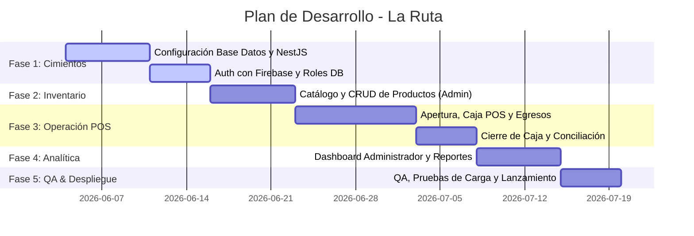

# Documento 5: Plan de Desarrollo, Roadmaps y Riesgos

Este documento establece la estrategia de implementación del **Sistema Web de Caja e Inventario para la Licorería "La Ruta"**, estructurado por fases de desarrollo, roadmaps y una matriz de análisis de riesgos comerciales y técnicos con sus planes de mitigación.

---

## 1. Plan de Desarrollo por Fases

El desarrollo se estima en **5 sprints (de 1 a 2 semanas cada uno)**, liderados por un desarrollador Full-Stack o un agente de programación automática.

### Detalle de las Fases:
* **Fase 1: Configuración de Entorno e Infraestructura**
  * Provisionamiento de base de datos PostgreSQL.
  * Inicialización del backend en NestJS con Prisma ORM.
  * Integración de Firebase Admin SDK en NestJS.
  * Inicialización del frontend con Vite + React + Tailwind CSS + Shadcn UI.
  * Implementación del módulo de login y protección de rutas según el rol.
* **Fase 2: Módulo de Inventario (Catálogo)**
  * Creación del modelo relacional de Categorías y Productos.
  * Implementación de endpoints CRUD de productos en el backend.
  * Interfaz de administración de stock en React (Buscador, filtros por stock mínimo).
* **Fase 3: Flujo de Caja y POS (Core de la Operación)**
  * Implementación de la apertura de caja y el control de turnos activos.
  * Construcción de la interfaz de ventas POS rápida (lista de productos, selección de impulsadora y método de pago).
  * Endpoints para registrar ventas y actualizar stock de forma transaccional.
  * Módulo de registro de egresos (gastos rápidos en efectivo).
  * Implementación del Cierre de Caja con desglose automatizado de discrepancias (faltantes/sobrantes).
* **Fase 4: Dashboard y Reportes**
  * Vista para el Administrador con los totales diarios acumulados.
  * Listado histórico de cierres de caja detallando diferencias de caja.
  * Gráfico de ventas totales y egresos del día.
* **Fase 5: Estabilización y Despliegue**
  * Pruebas de concurrencia en decremento de stock.
  * Refinamiento estético y micro-animaciones finales.
  * Despliegue del backend en VPS (ej. Render, Railway) y frontend en hosting estático (Vercel, Netlify).

---

## 2. Roadmaps del Producto

### 2.1 Roadmap MVP (Mínimo Producto Viable)
*El objetivo es digitalizar inmediatamente los cuadernos manuales con las funcionalidades estrictas.*
* **Caja:** Apertura y cierre de turno con un solo cajero activo.
* **Ventas (POS):** Registro de ventas seleccionando impulsadoras y métodos de pago (Efectivo, QR, Transferencia).
* **Egresos:** Registro rápido de egresos en efectivo del turno.
* **Inventario:** Control de stock simple (Nombre, Categoría, Precio Venta, Precio Compra, Stock, Stock Mínimo).
* **Seguridad:** Login para Administrador y Cajero.

### 2.2 Roadmap V2 (Reportes y Productividad)
*Enfocado en la automatización del análisis y la productividad del equipo.*
* **Reporte de Impulsadoras:** Estadísticas detalladas de rendimiento por impulsadora (quién vendió más, qué productos, etc.).
* **Exportación de Datos:** Descarga de cierres de caja en PDF y Excel para contabilidad.
* **Alertas Inteligentes:** Notificación vía email o mensaje de Telegram al administrador cuando los productos alcancen stock mínimo.
* **Caja Histórica:** Buscador y filtros de turnos pasados con auditoría de diferencias.

### 2.3 Roadmap V3 (Optimización de Operaciones)
*Mejoras tecnológicas para agilizar el punto de venta.*
* **Soporte de Escáner:** Integración de lector de código de barras USB para carga rápida de productos en el POS.
* **Ticketera Térmica:** Impresión física directa de recibos de venta internos.
* **Módulo de Compras:** Carga masiva de inventario mediante facturas de proveedores.
* **Log de Auditoría:** Historial de cambios de precios y stock indicando qué administrador realizó la modificación.

---

## 3. Matriz de Riesgos y Mitigación

### 3.1 Riesgos Técnicos

| Riesgo Técnico | Impacto | Probabilidad | Plan de Mitigación |
| :--- | :--- | :--- | :--- |
| **Pérdida de Conexión a Internet** (El sistema es en la nube y la licorería se queda sin internet). | **Alto** | **Media** | Implementar un sistema de respaldo de red 4G mediante un módem router en la tienda. A nivel de frontend, habilitar el almacenamiento temporal en `LocalStorage` para que el cajero pueda visualizar los precios e inventario de consulta incluso sin red. |
| **Concurrencia de Stock** (Dos cajeros o ventas simultáneas intentan comprar el último producto a la vez). | **Medio** | **Baja** | Usar transacciones ACID estrictas (`prisma.$transaction`) con nivel de aislamiento para bloquear la lectura del stock del producto hasta que se resuelva la venta. Si el stock es insuficiente, se rechaza la transacción y se notifica al usuario. |
| **Límite de Firebase Gratis** (Exceso de logins o subida de imágenes de productos). | **Bajo** | **Baja** | Configurar alertas de presupuesto en Google Cloud / Firebase. Para las imágenes de productos, optimizar y redimensionar las fotos en el cliente antes de subirlas a Firebase Storage para ahorrar ancho de banda y almacenamiento. |

### 3.2 Riesgos de Negocio

| Riesgo de Negocio | Impacto | Probabilidad | Plan de Mitigación |
| :--- | :--- | :--- | :--- |
| **Resistencia al Cambio** (El personal prefiere el cuaderno y encuentra el sistema "lento" o difícil). | **Alto** | **Alta** | Diseñar la interfaz con atajos de teclado (F1, F2, Barra Espaciadora) para que registrar una venta sea más rápido que escribirla a mano. Realizar capacitaciones guiadas interactivas en la tienda durante 3 turnos. |
| **Errores de Digitación** (Cajero registra efectivo incorrecto al abrir o cerrar la caja). | **Medio** | **Alta** | Colocar validadores en la interfaz que alerten si la diferencia física es inusualmente grande (ej: > 100 Bs) antes de guardar el cierre, requiriendo re-confirmación. |
| **Fugas Financieras por Ventas No Registradas** (El cajero vende un producto y no lo registra en el sistema). | **Muy Alto**| **Media** | Realizar auditorías de inventario sorpresivas semanales (Inventario Teórico en el sistema vs Inventario Físico en estantes). Al estar digitalizado el inventario, cualquier desajuste se detectará rápidamente. |
